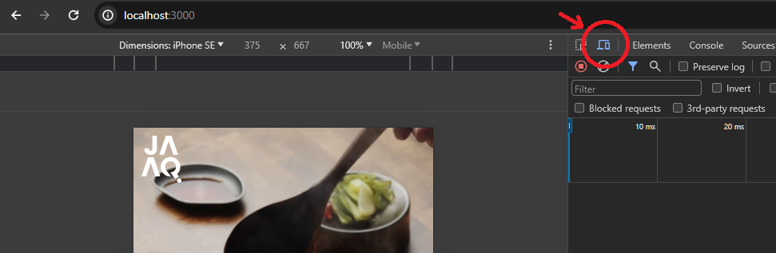

# JAAQ Player
This repo contains a simple .NET 8 API backend which serves some static video details from memory, as well as a React 18 app which allows the viewing of these videos via a TikTok style mobile SPA website.

According to the provided requirements:
- The app is mobile first - with touch controls for swiping up and down to change videos and double-tapping the screen to like the current video
- The app is responsive to a variety of different device sizes

The task took roughly 4-5 hours to complete with the majority of time being spent on the front-end.

## Running Locally
### Prerequisites
You will need the .NET 8 SDK installed as well as Node.js 18.

### Backend
Navigate to the `api` directory in your terminal and run the command `dotnet run --project ./Jaaq.Player.Api` to start the API running on port 5063 (HTTP) and 7076 (HTTPS) to serve data to the frontend.

### Frontend
Navigate to the `ui` directory in your terminal and run the command `npm run start` to start running the React app on port 3000.

Once it's up and running you can use the following button in Chrome to view the page responsively as the specified device type. Other browsers will have similar functionalities.

## Future Improvements
### Backend
- The API currently contains only a single very basic test as there is no real business logic to test - as the app develops in complexity it would be worth adding unit and integration tests to cover this.
- Instead of using a static in memory list of videos in a production use case you would of course use a datastore.
- Currently there is no users or auth (for simplicity) but this would of course be required in a production system.

### Frontend
- The liking of videos is a bit clunky right now due to the simplisticness of the implementation - given the video state is modified from a number of different components it would be a good use case for Redux or something similar.
- Liking a video is purely local and is not persisted - this should really be an API call that is stored against your user in the database.
- It is also only against the instance of the video (not against the video by its ID) which means that when the video shows up again it is not liked if it was previously. If I had more time I would've perfected this to track the liked videos by ID and used this instead of the index of the video in the list.
- Comments and sharing is not implemented.
- Failure handling (e.g. networking issues, etc.) are not handled currently but would be ideally implemented with an error bubble alert.
- Scrolling UX could be improved by rendering multiple videos and allowing scrolling between them with CSS "scroll snapping" to mimic TikTok/Instagram Reels.